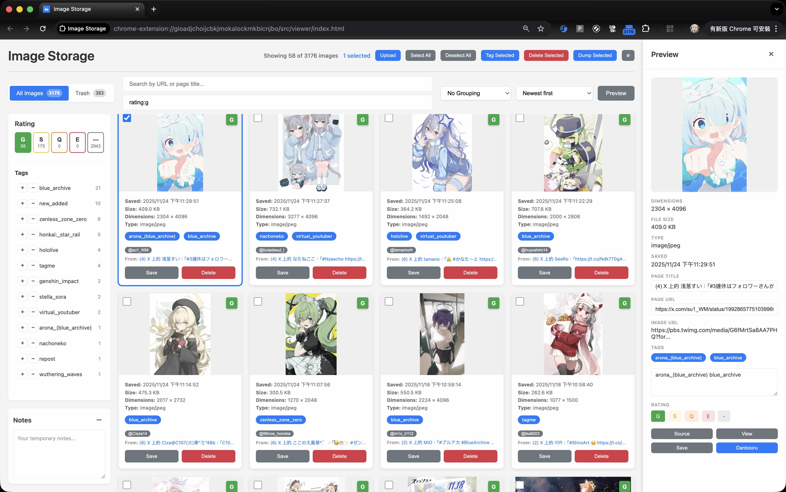

# Chrome Image Storage

> Save web images with their source context. Never lose where an image came from.

A Chrome extension for people who save images from the internet. Unlike "Save Image As...", this preserves the source URL, page title, and timestamp. Plus powerful management tools: tag search, ratings, bulk operations, and backups.

[](https://opensource.org/licenses/ISC)

---

**📌 Project Status:** This is an **AI-maintained** project (using Claude Code) in **early stage** for personal use. Expect active development and potential bugs. See [Contributing](#contributing) for details.

---

## The Problem

When you download images to a folder:
- ❌ No source URL - can't find the original page
- ❌ No page title - can't remember the context
- ❌ No timestamps - can't sort by when you saved it
- ❌ No search or filtering - just a pile of files

## The Solution

This extension saves images **with full context** in your browser's local storage:
- ✅ Source URL and page title preserved
- ✅ Save timestamp and dimensions tracked
- ✅ Powerful search and filtering (Danbooru-style tag search)
- ✅ Organize with tags and ratings
- ✅ Bulk operations and backups
- ✅ Everything stored locally - no cloud, no tracking

## Screenshots



## Quick Start

### Installation

**For normal users** (recommended):
1. Download the latest release from [Releases](https://github.com/shirohana/chrome-image-storage/releases)
2. Extract the ZIP file
3. Load in Chrome:
   - Open `chrome://extensions/`
   - Enable "Developer mode" (top right)
   - Click "Load unpacked"
   - Select the extracted folder

**For developers** (build from source):
1. Clone this repository
2. Install dependencies: `pnpm install`
3. Build: `pnpm build`
4. Load the `dist/` folder in Chrome (same steps as above)

### Upgrading to a New Version

⚠️ **CRITICAL: To keep your saved images when upgrading:**

1. Download the new release ZIP
2. Extract to the **SAME folder** where you first installed the extension
3. **Override all files** when prompted
4. Reload the extension in Chrome (`chrome://extensions/` → click reload button)

**⚠️ Data loss scenarios (AVOID THESE):**
- ❌ **Uninstalling the extension** - Deletes all IndexedDB data permanently
- ❌ **Loading from a different folder** - Creates new extension instance, old data inaccessible
- ❌ **Deleting the installation folder** - Data stays in browser but extension won't work

**To backup before upgrading:**
1. Open the viewer
2. Settings → "Export Database" → Save SQLite backup
3. Now safe to upgrade or reinstall
4. If needed, use "Import" button to restore data

### First Steps (5 minutes)

1. **Save an image**: Right-click any image → "Save to Image Storage"
2. **View your library**: Click the extension icon → opens viewer in new tab
3. **See the metadata**: Click an image to see source URL, page title, dimensions
4. **Try searching**: Use the search bar to filter by URL or page title
5. **Add tags**: Select an image → add tags in the preview pane → start organizing

## Core Features

### Save Images with Context
- **Right-click to save** - Works alongside browser's default menu
- **Full metadata** - Source URL, page title, timestamp, dimensions, file size
- **True local storage** - Images saved as complete files in IndexedDB (not just URLs)
- **Never breaks** - Images preserved even if source page disappears

### Browse and Search
- **Grid view** - Responsive layout with lazy loading for thousands of images
- **URL/Page search** - Filter by image URL, source page URL, or page title
- **Lightbox viewer** - Full-size view with keyboard navigation
- **Sorting** - By save date, updated date, file size, dimensions, or URL

### Organize with Tags and Ratings
- **Tag images** - Add/remove tags with autocomplete suggestions
- **Rating system** - Content ratings (General/Sensitive/Questionable/Explicit)
- **Danbooru-style tag search** - Complex queries like `girl cat -dog rating:s is:png`
- **Tag sidebar** - Interactive filtering with included (green) and excluded (red) tags
- **Clickable tags** - Click tags on cards to toggle them in/out of search

### Bulk Operations
- **Multi-select** - Checkboxes, click to select, keyboard navigation (Shift+Arrow)
- **Bulk tagging** - Add/remove tags from multiple images at once
- **Bulk rating** - Set ratings for selections
- **Bulk export** - ZIP export with metadata
- **Bulk delete** - Soft delete to trash (can restore)

### Advanced Management
- **Auto-tagging rules** - Automatically tag new images based on page title patterns
- **Duplicate detection** - Find images with matching dimensions and file size
- **Account grouping** - Organize images by X/Twitter account
- **SQLite backup** - Export/import full database with conflict resolution
- **Edit metadata** - Update page title and source URL for any image

## Usage Guide

### Saving Images

1. Right-click on any image on a webpage
2. Select "Save to Image Storage" from the context menu
3. A notification confirms the image was saved
4. Click the extension icon to view your library

### Searching and Filtering

**URL/Page Search** (top search bar):
- Filter by image URL, source page URL, or page title
- Example: `pixiv` finds all images from Pixiv

**Tag Search** (bottom search bar) - Danbooru-style syntax:

| Syntax | Meaning | Example |
|--------|---------|---------|
| `girl cat` | AND - both tags required | Images with girl AND cat |
| `girl or cat` | OR - either tag | Images with girl OR cat |
| `-dog` | Exclude tag | Images WITHOUT dog |
| `rating:g,s` | Rating filter | General OR Sensitive |
| `is:png,jpg` | File type filter | PNG OR JPEG images |
| `tagcount:>5` | Tag count filter | More than 5 tags |
| `tagcount:2..10` | Tag count range | Between 2-10 tags |
| `account:username` | Account filter | From X/Twitter account |
| `is:unrated` | Unrated filter | No rating set |

**Combine filters**: `girl cat -dog rating:s is:png tagcount:>2 account:artist123`

**Tag Sidebar**:
- Shows tags from filtered results
- Click tag name to include/remove from search
- Click **+** to include, **-** to exclude
- Highlighted tags: green (included), red (excluded)

**Sorting**: By save date, updated date, file size, dimensions, or URL

**Grouping**: Group by X/Twitter account or show duplicates (matching dimensions + file size)

### Tagging Images

**Single image**:
1. Select image → open preview pane or lightbox
2. Enter tags (space-separated, supports multi-line textarea)
3. Use autocomplete (press Enter to accept)
4. Auto-saves on blur

**Bulk tagging**:
1. Select multiple images with checkboxes
2. Click "Tag Selected" button or use preview pane bulk tool
3. Add tags, remove tags, or set rating
4. **Quick removal pills**: Top 10 common tags shown as clickable pills with counts
5. Click "Save" to apply

**Quick actions**:
- **Right-click tag** → Remove from image
- **Click tag on card** → Add/remove from search
- **Click account button** (X/Twitter) → Toggle account filter

### Rating Images

**Rating levels**:
- **G** (General) - Safe for work
- **S** (Sensitive) - Slightly suggestive
- **Q** (Questionable) - Questionable content
- **E** (Explicit) - Adult content

**Set rating**:
- **Quick**: Right-click image/rating badge → select from menu
- **Preview pane**: Radio buttons
- **Bulk**: Select multiple → "Tag Selected" button
- **Via tags**: Add `rating:g` tag (auto-converts to rating field)

**Filter by rating**:
- Click rating pills above tag sidebar (shows counts like "G 42")
- Or use search: `rating:g,s` or `is:unrated`

### Selection and Bulk Operations

**Select images**:
- Click checkboxes or card area
- **Select All** / **Deselect All** buttons
- **Shift + Click**: Range selection
- **Cmd/Ctrl + Click**: Toggle individual
- **Arrow keys**: Navigate, **Shift + Arrow**: Extend selection

**Bulk actions**:
- Tag/untag multiple images
- Set rating for selections
- Delete (soft delete to trash)
- Export as ZIP

### Keyboard Navigation

| Key | Grid View | Lightbox |
|-----|-----------|----------|
| Arrow keys | Navigate grid | Left/Right: prev/next<br>Up/Down: by columns |
| Shift + Arrow | Extend selection | - |
| Space | Open lightbox | Close lightbox |
| Escape | - | Close lightbox |

### Trash and Restore

- **Delete** → Moves to trash (soft delete)
- **Trash tab** → View deleted images
- **Restore** → Recover from trash
- **Delete Forever** → Permanent deletion
- **Empty Trash** → Clear all trashed images

### Editing Metadata

**Preview sidebar**: Always editable, auto-saves on blur (quick editing)

**Lightbox**: Read-only by default, click "Edit Metadata" to enable editing

Fields: Page Title, Page URL, Tags (with autocomplete)

## Advanced Features

### Auto-Tagging Rules

Automatically tag new images based on page title patterns.

**Setup**:
1. Open Settings (⚙ button)
2. Create a rule:
   - **Rule Name**: e.g., "Pixiv Images"
   - **Pattern**: Text or regex to match page title (empty = match all)
   - **Use Regex**: Enable regex matching
   - **Tags**: Space-separated tags (e.g., "pixiv illustration")
3. Click "Add Rule"

**Management**:
- Toggle rules on/off
- Edit (✎) or delete (×) existing rules
- Export/Import rules as JSON
- Smart duplicate detection on import

When you save an image, all enabled matching rules automatically apply their tags.

### Upload Local Files

1. Click "Upload" button in header
2. Select image files from your computer
3. Images imported with:
   - **Page Title**: From filename
   - **Page URL**: `file:///filename`
   - **Tags**: Auto-tagging rules applied based on filename

### SQLite Backup and Restore

**Export**:
1. Settings → "Export Database"
2. Choose folder location
3. Creates timestamped backup folder with manifest.json
4. Large datasets: Auto-splits into 200-image chunks (avoids memory errors)
5. Batched processing for thousands of images

**Import**:
1. Click "Import" button
2. Select one or multiple .db files (Ctrl/Cmd + Click for multi-file)
3. Choose conflict resolution:
   - **Skip**: Keep existing, import only new
   - **Override**: Replace existing with imported
   - **Review**: Side-by-side comparison for each conflict
4. Click "Import"

### Danbooru Integration

Upload images to self-hosted Danbooru instances.

**Setup** (one-time):
1. Settings → Danbooru section
2. Enter instance URL, username, API key
3. Save settings

**Upload**:
1. Select a single image
2. Click "Upload to Danbooru"
3. Review auto-filled metadata:
   - Tags (from image tags)
   - Artist (auto-detected from Pixiv, Twitter, Fanbox, DeviantArt, ArtStation URLs)
   - Source (from page URL)
   - Rating (from image rating)
4. Click "Upload to Danbooru"

## For Developers

### Development Setup

```bash
pnpm install          # Install dependencies
pnpm dev             # Development mode with hot reload
pnpm build           # Production build to dist/
pnpm test            # Run 150 unit tests (~11ms)
pnpm test:watch      # Watch mode for TDD
```

Load unpacked extension from `dist/` folder in Chrome.

### Tech Stack

- **TypeScript** + **Vite** - Fast type-safe development
- **Manifest V3** - Latest Chrome extension standard
- **IndexedDB** - Local storage for images (metadata + blobs)
- **JSZip** - ZIP export
- **Vitest** - 150 tests covering core logic

### Project Structure

```
src/
├── background/       # Service worker (saves images, anti-hotlinking)
├── content/          # Content script (canvas capture)
├── viewer/           # Image viewer UI (grid, search, tags)
├── storage/          # IndexedDB wrapper + service layer
└── types/            # TypeScript definitions
```

### Architecture Notes

**Three-context system**:
1. **Background**: Service worker (no DOM) - uses `createImageBitmap()` for dimensions
2. **Viewer**: Grid view with Danbooru-style search, lazy loading (Intersection Observer)
3. **Content**: Canvas capture first, background fallback if tainted

**Performance**:
- Lazy loading: Metadata loaded without blobs (~20-50MB vs ~6GB for 2000 images)
- Batched operations: SQLite export in 50-blob chunks
- Smart re-rendering: Single-card updates vs full grid re-render

**Storage schema**: See `src/types/index.ts` for `SavedImage` interface

### CSS Convention

**BEM naming** (Block__Element--Modifier):
- Block: `.tag-sidebar`, `.bulk-tag-modal`
- Element: `.tag-sidebar__heading`, `.bulk-tag-modal__input`
- Modifier: `.tag-sidebar-item--included`, `.rating-filter-pill--active`

Never use tag selectors - always explicit classes.

### Testing

150 tests covering:
- Tag search parser (50 tests)
- Tag query manipulation (49 tests)
- Auto-tagging rules (26 tests)
- Rating extraction (25 tests)

See `tests/README.md` for details.

## FAQ

**Q: How many images can it handle?**
A: Tested with thousands of images. Lazy loading keeps memory usage low (~20-50MB metadata). SQLite export auto-splits large datasets.

**Q: Where are images stored?**
A: In your browser's IndexedDB (local storage). Not synced to cloud.

**Q: Why isn't this on the Chrome Web Store?**
A: Manual installation keeps the extension lightweight and focused. Download pre-built releases from the [Releases page](https://github.com/shirohana/chrome-image-storage/releases) - no building required.

**Q: Does it work on Firefox/Edge/Brave?**
A: Built for Chrome/Chromium. May work on Edge/Brave (untested). Firefox needs porting (Manifest V3 differences).

**Q: Can I import existing image folders?**
A: Yes, use "Upload" button. Source URL will be `file:///filename`. Add metadata manually or via auto-tagging rules.

**Q: What's the difference between "Dump Selected" and "Export Database"?**
A: Dump = ZIP export of selected images. Export Database = SQLite backup of entire library (for migration/backup).

## Troubleshooting

**Images not saving?**
- Check browser console for errors
- Some sites block saving with CSP headers or anti-hotlinking
- Try viewing image in new tab first, then save

**Viewer not loading images?**
- Browser may have IndexedDB quota limits
- Check `chrome://quota-internals/` for storage usage
- Clear space or export/delete old images

**Export fails with memory error?**
- Use SQLite export instead of ZIP (batched processing)
- Export smaller selections
- Close other browser tabs to free memory

**All my images disappeared after upgrading/reinstalling?**
- If you loaded the extension from a **different folder**, your data is still in browser storage but inaccessible
- **Recovery**: Load the extension from the **original folder** where you first installed it
- If you **uninstalled** the extension, IndexedDB data is permanently deleted - no recovery possible
- **Prevention**: Always export database backup before major changes (Settings → "Export Database")
- For future upgrades: Extract new version to the SAME folder and override files

## Contributing

**Note about this project:**

This extension is currently **AI-generated** (primarily using Claude Code) and in **early stage** for personal use. The codebase is maintained through AI-assisted development workflows.

**If you want to contribute:**
- Feel free to open issues for bugs or feature requests
- Pull requests are welcome, but understand this is a personal-use project without formal contribution guidelines
- The maintainer may be selective about accepting changes to keep the project aligned with personal needs
- Code style and architecture follow AI-friendly patterns (see `CLAUDE.md` for development philosophy)

**For AI-assisted development:**
- See `CLAUDE.md` for project context, patterns, and development guidelines
- The project follows "make it work first" philosophy with minimal defensive code
- 150 tests cover core logic functions

## License

ISC
